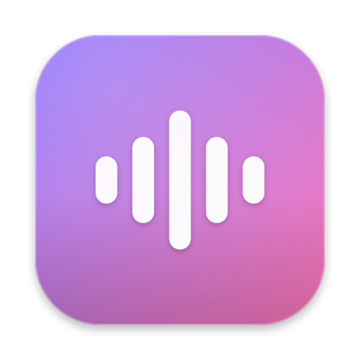

<p align="center">
  
</p>

<h1 align="center">Yapping <sub><sup>[Vibe-Coded]</sup></sub></h1>

<p align="center">Push-to-talk dictation for macOS. Hold <b>Fn</b>, talk, release.<br>Cleaned-up text lands wherever your cursor already is, in any app.</p>

Everything runs on your Mac. No account, no network, no telemetry. It is a local-first take on Wispr Flow: the same hold-a-key-and-talk loop, but the audio never leaves the machine.

## How it works

1. You hold the push-to-talk key (Fn by default). A small pill appears at the bottom of the screen with a waveform that follows your voice.
2. You talk. Apple's on-device speech model transcribes as you go.
3. You release. Yapping cleans up the text and pastes it into the focused app, then puts your old clipboard back.

Release to paste takes about 200 ms for a short phrase. The cleanup step varies. See [Cleanup](#cleanup) below.

## Push-to-talk key

Fn is the default trigger, and it always works on the built-in keyboard. You can add a second key in Settings for a keyboard that has no usable Fn, such as an external mechanical one.

A QMK layer key will not work as the trigger. It switches layers inside the keyboard firmware and sends nothing to macOS, so Yapping never sees it. macOS also treats Fn as a vendor-specific key that QMK cannot emit. So instead of chasing Fn, map a QMK key to one of these and pick it under Settings, Also trigger with:

- **F13 through F19.** The safest choice. They type nothing and have no default action in macOS, so they only ever start dictation. In QMK, map a key to `KC_F13`.
- **Right Control, Option, Command, or Shift.** These work too, but they also do their normal job, so the modifier fires dictation whenever you use it in a shortcut. On a US layout, Right Option types accents, so skip it there. On a Spanish or Latin American layout accents come from the dedicated dead key instead, which leaves Right Option free.

Both triggers stay live at once. Hold Fn on the laptop or your mapped key on the mechanical keyboard, whichever you are on. Holding both and letting go of one keeps recording until the last key comes up.

## Requirements

- macOS 26 or later, Apple Silicon.
- Xcode 26 and [XcodeGen](https://github.com/yonaskolb/XcodeGen) to build.
- Two permissions on first launch: Accessibility and Microphone.

Accessibility is not optional. Yapping watches the push-to-talk key with a global event tap and pastes with a synthetic Command-V, and macOS gates both behind that permission. The menu has a checklist with buttons that jump straight to the right System Settings pane.

## Build and run

```sh
brew install xcodegen
make run      # generate the project, build, relaunch
make test     # run the unit tests
make open     # open the generated Yapping.xcodeproj in Xcode
make icons    # regenerate the app icon and menu bar glyphs
```

`Yapping.xcodeproj` is generated and gitignored. Edit `project.yml`, not the project file.

## Speech engines

Both run on-device. Pick one in Settings.

| Engine | Model | Languages | Notes |
|---|---|---|---|
| Apple Speech (default) | `SpeechAnalyzer`, system model | English and Spanish variants shown; ~30 available | Streams partial words while you talk. Model downloads on first use of a language. |
| Parakeet | NVIDIA Parakeet TDT 0.6B v3 on CoreML, via [FluidAudio](https://github.com/FluidInference/FluidAudio) | 25 European languages plus Japanese | Transcribes in one pass when you release. About 600 MB, downloaded on first select into `~/Library/Application Support/FluidAudio/Models`. |

The language dropdown lists English and Spanish only, since that is what I use. Apple ships regional variants (Mexico, Chile, Spain, and so on) but nothing generic like "Latin America", so pick the closest. If your system region has no matching model, `LocaleResolver` falls back by language, so Argentina lands on a Spanish model instead of failing silently.

## Cleanup

The raw transcript passes through one of three processors before it gets pasted.

| Mode | Speed | What it does |
|---|---|---|
| Quick cleanup (default) | under 5 ms | Drops filler words like "um" and "uh", collapses stutters, fixes punctuation and capitalization. Rules, no model. |
| Apple Intelligence | a few seconds on an M1 | Runs the on-device language model to rewrite the text. It skips the call when the transcript already looks clean. |
| Raw transcript | none | Exactly what the speech engine heard. |

Quick cleanup is the default. The language model produced better prose on messy input, but it cost about 7.5 seconds per phrase on my M1 and changed nothing most of the time. Rules cover the common case in microseconds, so the language model is there for when you want it, not on the hot path.

## Architecture

One push-to-talk cycle runs through a small pipeline:

```
key down → HotkeyMonitor → DictationSession
                              ├─ AudioCapture         (mic → level-metered buffer stream)
                              ├─ TranscriptionEngine  (SpeechAnalyzer | Parakeet)
                              ├─ TextProcessor        (Quick | Apple Intelligence | Raw)
                              └─ TextInserter         (save clipboard → ⌘V → restore)
```

`DictationSession` is an actor-like `@MainActor` state machine that owns the cycle. A few decisions worth calling out:

- **The hotkey tap runs on its own thread.** A `CGEventTap` on the main run loop gets starved whenever the main thread is busy with layout or audio work, and macOS then disables it by timeout. When that happened mid-press, the release event was dropped and the recording ran forever. One 68-second runaway is what sent me looking. The tap now lives on a dedicated high-priority thread and is listen-only, so UI work cannot delay it. If it is ever disabled while a key is held, it fires a synthetic release so a recording cannot hang. A 150-second cap is the last resort.
- **Overlapping presses queue instead of cancelling.** Press again while the previous phrase is still finalizing and the old one still finishes and pastes, while the new recording starts right away. A generation counter decides which recording owns the UI and the mic.
- **Engines and processors are protocols.** `TranscriptionEngine` and `TextProcessor` each have a couple of implementations behind them, so adding a cloud engine or a different cleanup backend later means writing one type, not touching the pipeline.

Source is grouped by role under `Yapping/`: `App`, `Core/{Hotkey,Audio,Transcription,Processing,Output,Pipeline}`, and `UI/{MenuBar,Overlay,Settings}`. Tests live in `YappingTests/` and cover the state machine, the pasteboard save-and-restore, locale fallback, and both cleanup paths, with fakes for the engine, processor, and inserter.

## Signing

Debug builds are signed with a self-signed "Yapping Dev" certificate in the login keychain. macOS ties the Accessibility grant to the exact code signature, and ad-hoc signing changes that signature on every build, so the grant would reset each time you rebuild. A stable certificate keeps it. To make your own:

```sh
# create a self-signed code-signing cert, then trust it
# (Keychain Access → Certificate Assistant → Create a Certificate,
#  type: Code Signing) and set its name as CODE_SIGN_IDENTITY in project.yml
```

Or use a free Apple personal team: add your Apple ID in Xcode under Settings → Accounts, then set `DEVELOPMENT_TEAM` and `CODE_SIGN_IDENTITY: "Apple Development"` in `project.yml`.

Yapping runs unsandboxed, because posting keyboard events and reading the frontmost app need it. That rules out the App Store, so distribution means Developer ID and notarization.

## Branding

The identity is a glass wave: a violet `#7C5CFF` to pink `#FF5CA8` gradient squircle with a white five-bar waveform. Colors, the wordmark, the glyph, and the playful copy all live in `Yapping/UI/Brand.swift`. The app icon and the menu bar glyphs are generated by `Tools/iconsmith.swift`, so `make icons` rebuilds them from code.

## Debugging

Logs go through the unified logging system under one subsystem:

```sh
/usr/bin/log stream --info --predicate 'subsystem == "com.nicorossi.yapping"'
```

Use the full path. Plain `log` hits the zsh builtin and prints nothing useful.
